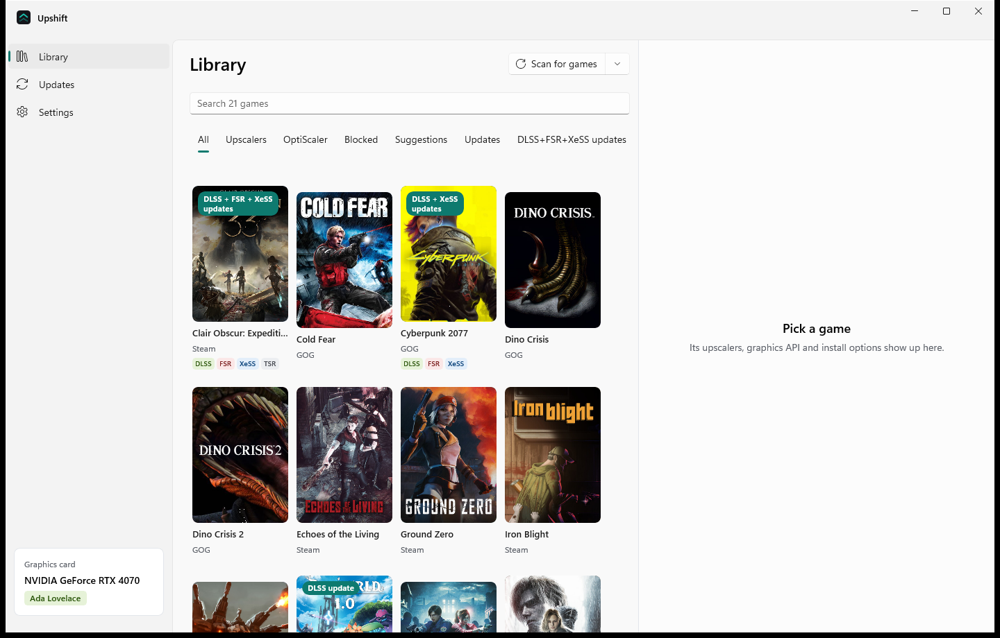
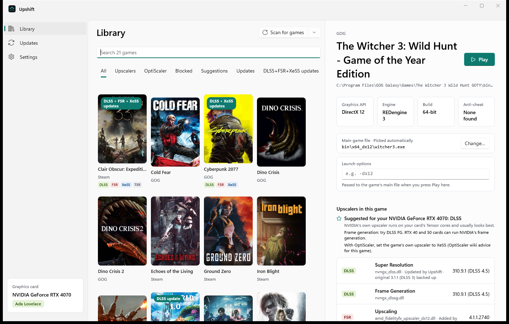
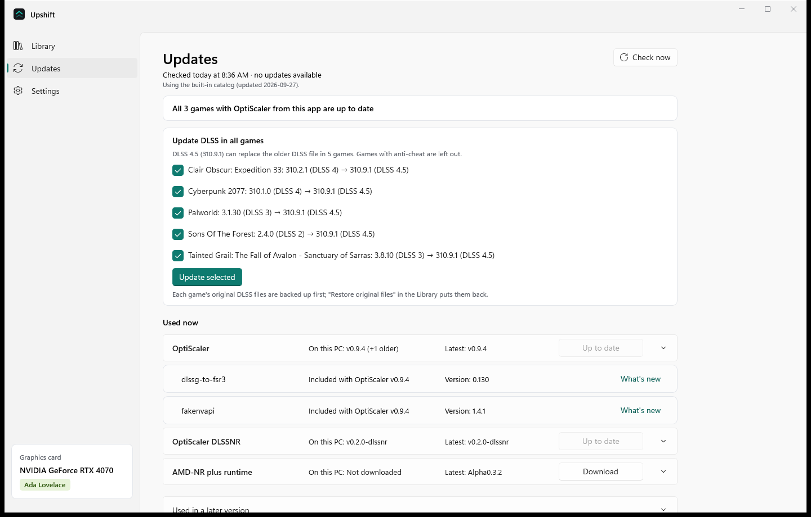

# Upshift

Upshift finds the games on your PC, shows which upscalers each one ships with (DLSS, FSR, XeSS, TSR…), suggests
what suits your graphics card, and installs the official [OptiScaler](https://github.com/optiscaler/OptiScaler)
release into a game: with a backup of every file it touches, a record of every change, and an exact uninstall.

> **Upshift is a free, unofficial tool. It isn't made by or affiliated with the OptiScaler team, NVIDIA, AMD or
> Intel.** Everything it installs is downloaded from each project's own GitHub releases; nothing is re-hosted.

## Install

Download from the [latest release](https://github.com/PCVGS-CA/Upshift/releases/latest):

- **`Upshift-Setup-x64.exe`**: installs Upshift for your Windows account (no admin rights needed) into
  `%LocalAppData%\Upshift.App`, with a Start menu shortcut. Uninstall it from Windows Settings > Apps; it asks
  whether to delete your Upshift data as well, and keeps it unless you say yes.
- **`Upshift-Portable-x64.zip`**: no installer. Unzip it to a folder of its own and run `Upshift.exe`.

Both update themselves: Upshift checks for a new version at start-up (when "Check for updates automatically" is on)
and in Settings > About, and installs it when you choose **Restart to update**.

The files aren't code-signed yet, so Windows SmartScreen may say "Windows protected your PC" (choose More info >
Run anyway), and on PCs with Smart App Control turned on, Windows may block them.

## Screenshots

_Coming soon._

<!--

-->

## What it does

- **Finds your games** from Steam, Epic, GOG, the Xbox app / Game Pass, EA app, Ubisoft Connect, Battle.net,
  Heroic and itch.io, installed programs that look like games, folders you add yourself, and (optionally) a scan of
  every drive.
- **Looks inside each game:** DLSS, FSR, XeSS and Streamline files and their versions (DLSS versions with their
  names, e.g. "310.9.1 (DLSS 4.5)"), the main .exe, 32/64-bit, DirectX 11/12 or Vulkan, the engine, anti-cheat, and
  mods that are already there. Games with anti-cheat are never modified.
- **"Upscalers in this game":** what the files show, merged with PCGamingWiki, plus "Suggestions for this game"
  from the OptiScaler wiki.
- **Installs OptiScaler** the way its own setup does, under the loading name you choose (dxgi.dll by default).
  Every game file it overwrites is backed up first, and everything is recorded in `.upshift\manifest.json` in the
  game folder. Uninstall removes only the files it added (if unchanged) and puts the originals back.
- **Upscaler files:** updates the DLSS, FSR and XeSS DLLs a game ships with to newer ones from NVIDIA's, AMD's and
  Intel's own GitHub pages (for example DLSS 3.x to 310.9.1, DLSS 4.5, which unlocks the DLSS 4 and 4.5 models).
  Only swaps known to work are offered, only files the game already has are replaced, every new file must carry its
  vendor's digital signature, and "Restore original files" puts the exact originals back.
- **OptiScaler options** per game: upscaler, frame generation, DLSS model and FSR 4 (INT8), each with a
  "Which one should I pick?" guide.
- **Updates:** checks each component's GitHub releases (cached, with ETags), lets you pick Stable or Beta, updates
  games while keeping your OptiScaler settings, and can undo the last update exactly. Changed or missing files are
  flagged at scan time and can be repaired.
- **Play:** starts a game through its store (Steam, Epic, GOG, …), with optional launch options. Games are never
  started with admin rights.
- **"Changes Upshift made to this game":** a dated list of everything it changed in each game folder.
- **Cover art** from Steam's local cache, GOG, Epic and the Steam store, and optionally SteamGridDB (with your own
  API key).

When a game folder needs admin rights (games under Program Files), Upshift starts a second copy of itself with a UAC
prompt for just that one change. The main window never runs as administrator.

## Requirements

**To run:** Windows 10 version 1809 or later, or Windows 11; 64-bit (x64). The build is self-contained, so no
separate .NET or Windows App SDK install is needed. An internet connection is used for downloads, cover art and wiki
lookups; everything else works offline.

**To build:**

1. Install **Visual Studio 2022 or newer** (Community is free) with the **"WinUI application development"**
   workload, which includes the .NET 8 SDK.
2. Open **Upshift.sln**, set the platform to **x64** and the startup project to **Upshift.App**.
3. Press **F5**. The first build downloads the NuGet packages.

Or from a Developer Command Prompt: `msbuild Upshift.sln /p:Configuration=Debug /p:Platform=x64`

**To make the installer and portable zip locally:** `powershell -ExecutionPolicy Bypass -File build\package.ps1`
(output in `releases\`). It uses Velopack's `vpk`, pinned in `dotnet-tools.json`.

## Releasing

1. Set the new version in `Directory.Build.props` (the only place it's set).
2. Add a `## [x.y.z]` section to `CHANGELOG.md`; it becomes the release notes.
3. Commit, then push a tag with the same version: `git tag v1.2.3` and `git push origin v1.2.3`.

The [Release workflow](.github/workflows/release.yml) builds Release x64, makes the installer, the portable zip and
the self-update packages, and publishes them as a GitHub release. It stops if the tag and the version differ.

## Where it keeps things

Everything Upshift stores lives in `%LocalAppData%\Upshift`: the library cache, settings (including an optional
SteamGridDB key), cover art, downloaded components, files you supply, wiki caches and `logs\`. None of it is part of
this repository. The installed program is in a separate folder, `%LocalAppData%\Upshift.App`, so uninstalling never
touches your data unless you ask it to. In game folders, Upshift only writes the files it installs and its own
`.upshift` folder.

## Project layout

- `src/Upshift.Core`: all the logic, no UI. Discovery (launchers), Detection (what's inside a game), Hardware (GPU),
  Catalog (`catalog.json`: download sources, DLSS presets and names, guide text), Components (GitHub releases and
  downloads), Install (install, update, undo, repair, options), Launch, Wiki, Artwork and Services.
- `src/Upshift.App`: the WinUI 3 app (Library, Updates and Settings pages).

`catalog.json` holds everything that changes more often than the app: pinned versions, asset patterns, DLSS names
and the "Which one should I pick?" text. A newer catalog can be loaded from the "Catalog address" setting.

## Credits

Upshift downloads, installs or reads information from these projects. All credit for them goes to their authors.

- **[OptiScaler](https://github.com/optiscaler/OptiScaler)**: the upscaler and frame-generation mod Upshift installs.
- **[OptiScaler DLSSNR](https://github.com/Dagherbou/OptiScaler_DLSSNR)**: an OptiScaler fork that adds DLSS 5
  Neural Rendering.
- **[AMD-NR](https://github.com/3zwr1/AMD-NR---OptiScaler)**: an OptiScaler fork for neural rendering on AMD cards,
  with the AMD-NR runtime by danielblnc.
- **[dlssg-to-fsr3](https://github.com/Nukem9/dlssg-to-fsr3)** by Nukem9: runs FSR frame generation through a
  game's DLSS Frame Generation option (bundled with OptiScaler).
- **[fakenvapi](https://github.com/optiscaler/fakenvapi)**: Reflex support through Anti-Lag 2, LatencyFlex or XeLL
  on non-NVIDIA cards (bundled with OptiScaler).
- **[PCGamingWiki](https://www.pcgamingwiki.com/)**: engine and upscaler information for each game. PCGamingWiki
  content is available under
  [CC BY-NC-SA 3.0](https://creativecommons.org/licenses/by-nc-sa/3.0/); Upshift links back to each game's page.
- **[The OptiScaler wiki](https://github.com/optiscaler/OptiScaler/wiki)**: the compatibility list and per-game
  notes behind "Suggestions for this game".

Built with the [Windows App SDK](https://github.com/microsoft/WindowsAppSDK),
[CommunityToolkit.Mvvm](https://github.com/CommunityToolkit/dotnet),
[SharpCompress](https://github.com/adamhathcock/sharpcompress) and [Velopack](https://github.com/velopack/velopack)
(installer and updates). NVIDIA DLSS, AMD FidelityFX and Intel XeSS are
trademarks of their owners.

## License

Not chosen yet.
